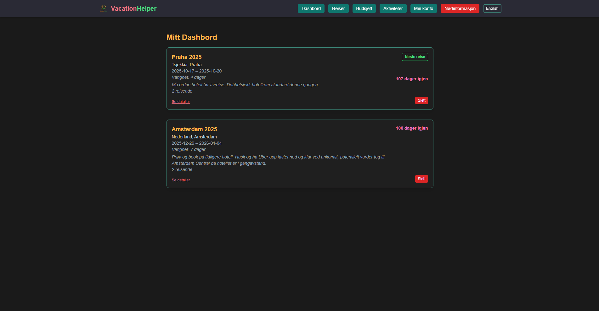

<p align="center">
  
</p>

# 🏖️ Feriehjelper – Planlegg ferien din med oversikt og ro

**Feriehjelper** er en nettbasert app for å organisere, planlegge og håndtere ferien din.  
Alt fra budsjett og destinasjoner til aktiviteter og nødinfo samles på ett sted – designet for reisende, av en reisende.

---

## 🧠 Formål og motivasjon

Som reisende kan det være vanskelig å holde orden på alt før, under og etter en ferie.  
Denne appen skal gjøre det lettere å holde styr på reiseplaner, utgifter, viktige kontakter og daglige aktiviteter – alt i én app.

Dette er et personlig og viktig prosjekt for meg, med høy nytteverdi og stor læringsverdi.

---

## 👤 Målgruppe

Alle som reiser og ønsker struktur i ferien sin – både for korte turer og store eventyr.  
Appen skal være nyttig for både unge og voksne brukere.

---

## 🌍 Kjernefunksjoner

- ✈️ **Reisemål og oppholdssteder**
  - Legg til destinasjoner og opphold
  - Se tidligere og kommende reiser
- 💸 **Budsjettstyring**
  - Total- og dagsbudsjett
  - Registrer utgifter og se status
- 🗓️ **Aktivitetsplanlegging**
  - Lag og rediger dagsplaner
- 🚨 **Viktig informasjon**
  - Nødnummer, adresser, ambassader
  - Tilgjengelig på egen "nødsideseksjon"
- 🔐 **Innlogging (planlagt)**
  - Google-login via Clerk
  - Data kobles til brukerens konto

---

## 🛠️ Teknologi brukt

- **Next.js** – React-basert frontendrammeverk
- **Tailwind CSS** – Moderne stilsett
- **Clerk (planlagt)** – Autentisering
- **Lagring** – Lokalt først, vurderer Turso
- **Figma** – Design og prototyping  
  🔗 [Se Figma-design](https://www.figma.com/design/Kwan0kW2iruFBvpFBPl7Ln/Sommerprosjekt-2025?node-id=0-1&t=pgXF24W2y5tx30Ge-1)

---

## 🗂️ Prosjektstruktur

```
feriehjelper/
├── public/             # Bilder og logo
├── src/                # Kodebase
│   ├── components/     # UI-komponenter
│   ├── pages/          # Sider og ruter
│   ├── styles/         # Globale stilark
│   └── app/            # Hovedlayout (Next.js App Router)
├── package.json        # Scripts og avhengigheter
└── tailwind.config.js  # Tailwind-oppsett
```

---

## 📸 Eksempel på appen

<p align="center">
  
</p>

---

## 💡 Planlagte og mulige utvidelser

- 📦 Pakkeliste – huk av ting du må ha med
- 🗺️ Kart – vis reisemål og aktiviteter
- 📓 Feriedagbok – skriv notater og minner
- 💱 Valutakalkulator – NOK til lokal valuta
- 🌦️ Værmelding – via API
- 📂 Dokumenter – last opp pass/billetter
- 🔔 Påminnelser – f.eks. dagsaktiviteter
- 📤 Deling – send plan til familie/venner
- ❤️ Favoritter – steder du vil besøke igjen

---

## ✍️ Signatur

```
//  One bug to find them,
//  One fix to bring them all,
//  And in the darkness bind them.
```

---

## 📬 Kontakt

Har du forslag eller innspill? Ta kontakt – prosjektet er aktivt under utvikling!

---